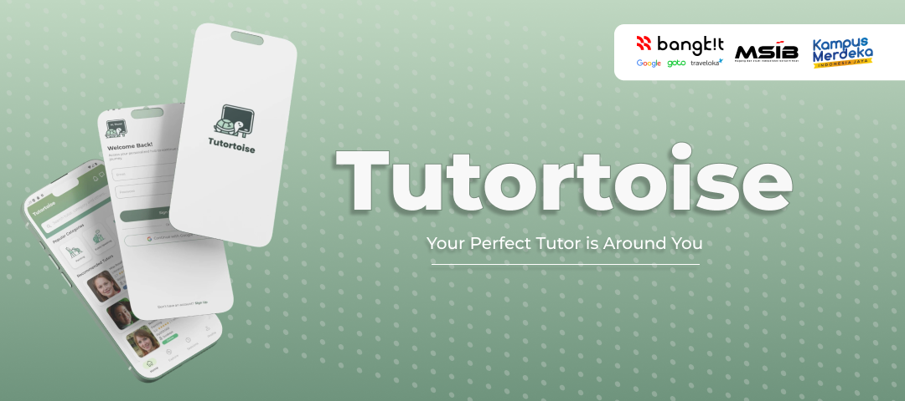
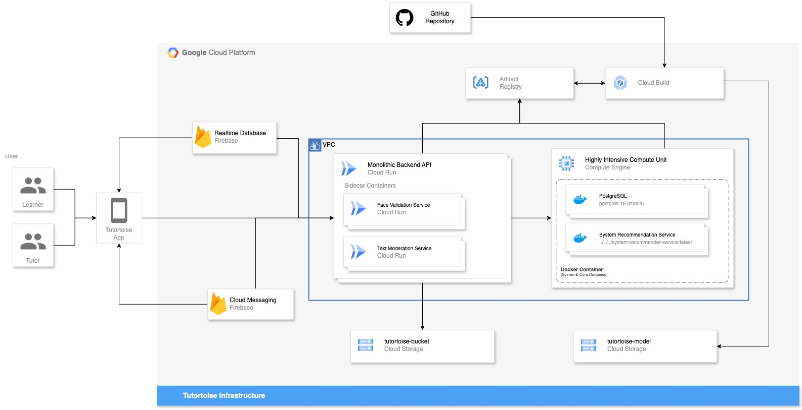
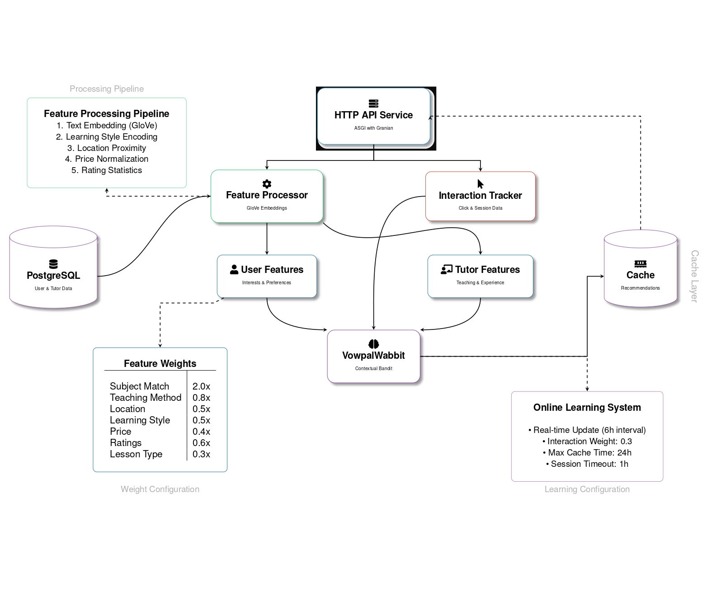
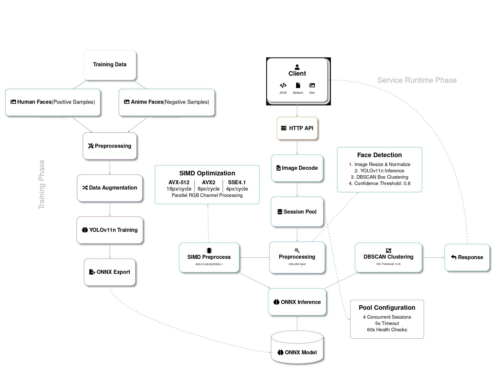
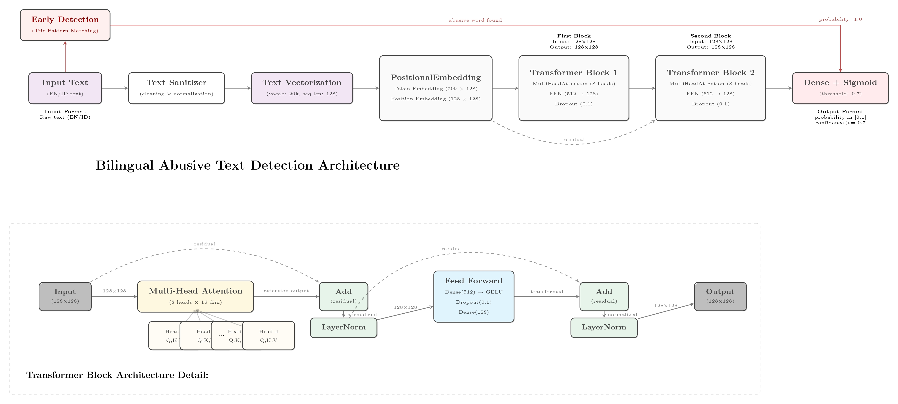

# 🐢 Tutortoise: Your Perfect Tutor is Around You

**Tutortoise** is a platform that connects leaners with skilled tutors, making personalized education accessible and flexible. Learners can find tutors based on subjects, budgets, schedules, and preferred learning methods (online or on-site). Designed with a user-centered approach, Tutortoise aims to overcome barriers in education, empower learners, and enhance the quality of tutoring through innovative technology.

## ✨ Meet The Awesome Team Behind Tutortoise

<table>
  <thead>
    <tr>
      <th>Learning Path</th>
      <th>Bangkit ID</th>
      <th>Name</th>
      <th>LinkedIn</th>
    </tr>
  </thead>
  <tbody>
    <tr>
      <td rowspan="3">Machine Learning</td>
      <td>M762B4KX0924</td>
      <td>Chika Tunjung Keyna</td>
      <td><a href="https://www.linkedin.com/in/chikatunjungkeyna/">Profile Link</a></td>
    </tr>
    <tr>
      <td>M420B4KY1012</td>
      <td>David Hendrawan</td>
      <td><a href="https://www.linkedin.com/in/davidhendrawan/">Profile Link</a></td>
    </tr>
    <tr>
      <td>M284B4KY1760</td>
      <td>Helmy LuqmanulHakim</td>
      <td><a href="https://www.linkedin.com/in/helmyl/">Profile Link</a></td>
    </tr>
    <tr>
      <td rowspan="2">Cloud Computing</td>
      <td>C420B4KY1355</td>
      <td>Faidil Anwar</td>
      <td><a href="https://www.linkedin.com/in/faidil">Profile Link</a></td>
    </tr>
    <tr>
      <td>C269B4KY2786</td>
      <td>Muhammad Dony Mulya</td>
      <td><a href="https://www.linkedin.com/in/mdonym/">Profile Link</a></td>
    </tr>
    <tr>
      <td>Mobile Development</td>
      <td>A269B4KY3064</td>
      <td>Muhammad Rizky Aulia</td>
      <td><a href="https://www.linkedin.com/in/muhammad-rizky-aulia-bb6bb12b0/">Profile Link</a></td>
    </tr>
  </tbody>
</table>

## 🏗️ Infrastructure

## 🛠️ Technical Components & Tools

Below are the technologies and tools that we use to build Tutortoise.

### 🤖 Machine Learning System

Our ML System consists of three main services:

#### 1. Recommender System

  
View Architecture

  

- **Tech**: VowpalWabbit, FastAPI
- **Features**: Real-time recommendation (batch & online), Hybrid System (Content-based & Collaborative Filtering), Weighted Features
- [📦 View Repository](https://github.com/tutortoise/system-recommender-service)

#### 2. Profile Picture Moderation

  
View Architecture

  

- **Tech**: Go, ONNX Runtime, YOLOv11n
- **Features**: Fast Inference, Lightweight, High Precision
- [📦 View Repository](https://github.com/tutortoise/face-validation-service)

#### 3. Content Moderation

  
View Architecture

  

- **Tech**: TensorFlow, FastAPI
- **Features**: Bilingual support (EN/ID), Contextual Abusive Detection
- [📦 View Repository](https://github.com/tutortoise/bilingual-abusive-detection-service)

### ☁️ Backend & Cloud Infrastructure

### 📱 Mobile Development

